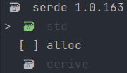

# Cargo Features Manger

A TUI-like cli tool to manage the features of your rust-projects dependencies.

You can view all available features and easily toggle (enable & disable) them with one button click. All of your changes
will directly be reflected in your Cargo.toml file.

---

## install

`cargo install cargo-features-manager`

---

## usage

To start the tool run `cargo features` in your project root dir.

This will open the dependency-selector:


Now you can select the dependency for which you want to change the enabled features.

Selecting a dependency will open the feature-selector:


When using `cargo features -d <dependency name>` it will directly open the corresponding feature-selector.

### navigation

<kbd>↑</kbd> to move up

<kbd>↓</kbd> to move down

<kbd>Space</kbd> | <kbd>Enter</kbd> | <kbd>→</kbd> to select

<kbd>ESC</kbd> | <kbd>←</kbd> to move back

### dependency selector

Dependency which do not have any features are marked grey. <br>
Dev-Dependency are marked with 🧪. <br>
Build-Dependency are marked with 🛠️. <br>
Workspace-Dependency are marked with 🗃️️.


### feature selector

All default features are marked Green.


When hovering above a feature it shows other features which the selected feature requires.


Features marked with 📦 mean that they require an optional dependency.


Features which an active feature requires are marked grey.


Features marked with 🗃️️ are enabled by the workspace dependency and can only be disabled by the workspace dependency



### search mode

At any point you can start typing like normal.
This will start using your input as a search query.

---

## prune

You can run prune with `cargo features prune`

this will disable all features which are not required to compile.

### false positives

Some features may not cause the compilation to fail but still remove functionality. To limit the extent of such cases we
keep a [file](Known-Features.toml) including all known false positives. These features will not be disabled
by `cargo features prune` and instead be display gray letting you know that you should consider if you really need the
feature.

If you know of any other features that fall under this category fell free to open an Issue or PR!

If your project requires additional features to be always kept. You can add a section to your `Cargo.toml`
named `cargo-features-manager.keep` in there you can define which features will be kept.

```toml
# Cargo.toml

# for individial packages
[cargo-features-manager.keep]
clap = ["default"]
color-eyre = ["capture-spantrace", "track-caller"]

# for the whole workspace
[workspace.cargo-features-manager.keep]
clap = ["default"]
color-eyre = ["capture-spantrace", "track-caller"]
```