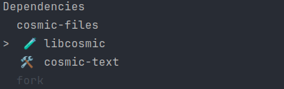
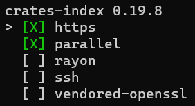
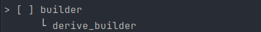
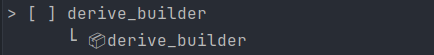

# Cargo Features Manger

A TUI-like cli tool to manage the features of your rust-projects dependencies.

You can view all available features and easily toggle (enable & disable) them with one button click. All of your changes
will directly be reflected in your Cargo.toml file.

## install

`cargo install cargo-features-manager`

## usage

### viewer

To start the tool run `cargo features` in your project root dir.

This will open the dependency-selector:



Now you can select the dependency for which you want to change the enabled features.

Selecting a dependency will open the feature-selector:



When using `cargo features -d <dependency name>` it will directly open the corresponding feature-selector.

#### navigation

<kbd>↑</kbd> to move up

<kbd>↓</kbd> to move down

<kbd>Space</kbd> | <kbd>Enter</kbd> | <kbd>→</kbd> to select

<kbd>ESC</kbd> | <kbd>←</kbd> to move back

#### dependency selector

Dependency which do not have any features are marked grey. <br>
Dev-Dependency are marked with 🧪. <br>
build-Dependency are marked with 🛠️.


#### feature selector

All default features are marked Green.


When hovering above a feature it shows other features which the selected feature requires.



Features marked with 📦 mean that they require an optional dependency.



Features which an active feature requires are marked grey.


#### search mode

At any point you can start typing like normal.
This will start using your input as a search query.

### prune

You can run prune with `cargo features prune`

this will disable all features which are not required to compile.

#### always keep

If your project requires a features to be enabled which does not make the compile fail. you can create a file
called `Features.toml` in there you can define features which will not get disabled.

```toml
clap = ["help"]
```